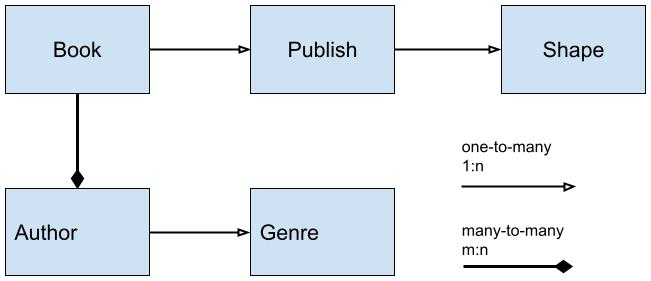

As relações são:

As tabelas e os seus campos serão:

1. Book
   1. objectId
   2. typeString
   3. typeBoolean
   4. typeNumber
   5. typeDate
   6. typeArray
   7. **typePointerPublisher**
   8. **typeRelationAuthor**
2. Publisher
   1. objectId
   2. typeString
   3. typeBoolean
   4. typeNumber
   5. typeDate
   6. typeArray
   7. **typePointerShape**
3. Author
   1. objectId
   2. typeString
   3. typeBoolean
   4. typeNumber
   5. typeDate
   6. typeArray
   7. **typePointerGenre**
4. Genre
   1. objectId
   2. typeString
   3. typeBoolean
   4. typeNumber
   5. typeDate
   6. typeArray
5. Shape
   1. objectId
   2. typeString
   3. typeBoolean
   4. typeNumber
   5. typeDate
   6. typeArray
   7. typeFile
   8. typeObject